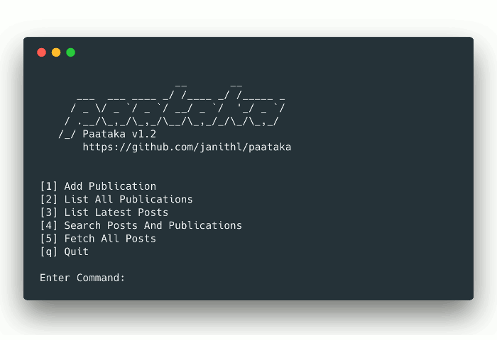

# Paataka

A simple newsreader written in golang, currently has a CLI and a REST API.

[](https://godoc.org/github.com/janithl/paataka)

## Features

- Add publications and their RSS feeds
- View their latest posts
- Search through posts and find similar posts

## Releases

The [releases page](https://github.com/janithl/paataka/releases) has release
notes and binaries for Linux and Mac OS

## Running/Building

Run `go run paataka.go` to run as a CLI, and `go run paataka.go -http` to run
the REST API. Run `go build paataka.go` to compile a binary.

I use go's amazing built-in cross-compilation to build for different OSes and
architectures. For example to build for Linux 386:

```
env GOOS=linux GOARCH=386 go build paataka.go
```

## To Run Tests

```
go test ./... -coverprofile=cover.out
```

To view the coverage report in HTML, install the tool `cover` and run
`go tool cover -html=cover.out`

## License

Paataka is released under the [MIT License](http://opensource.org/licenses/MIT).
